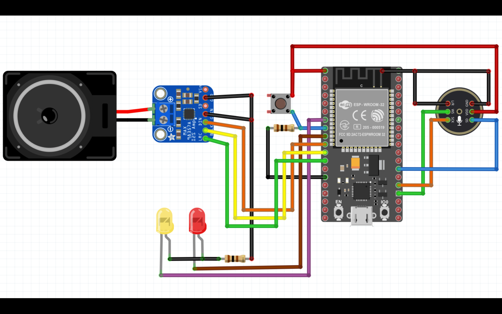
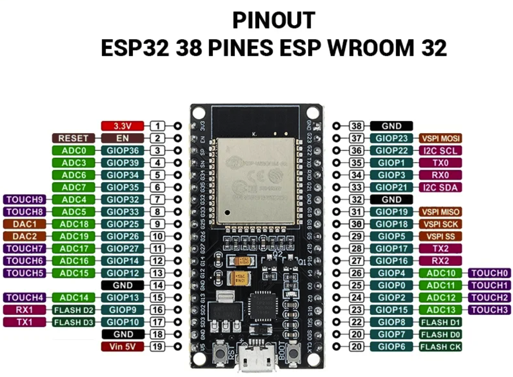

# ESP32 ChatGPT Voice Assistant

This repository contains the code and instructions for creating a voice assistant using an ESP32 and ChatGPT. The voice assistant can record audio, send it to a server for transcription, and then receive and play back a response generated by ChatGPT.

## Features

- **Audio Recording**: Records audio using an INMP441 microphone connected to the ESP32.
- **Wi-Fi Connectivity**: Connects to Wi-Fi to communicate with a Node.js server.
- **Audio Playback**: Plays the response audio using a MAX98357A I2S amplifier.
- **ChatGPT Integration**: Sends the recorded audio to a Node.js server, which uses OpenAI's ChatGPT for transcription and response generation.

## Hardware Requirements


## Software Requirements

- ESP32 Arduino Core
- Node.js
- Express.js
- OpenAI API key

## Circuit Diagram





## Installation

### ESP32 Setup

1. **Clone the repository**:
    ```bash
    git clone https://github.com/fiqgant/esp32_chatgpt_voice_assistant.git
    ```

2. **Open the `chatgpt_voice` project in Arduino IDE or PlatformIO**.
3. **Install the required libraries**:
    - `driver/i2s.h`
    - `SPIFFS.h`
    - `WiFi.h`
    - `HTTPClient.h`

4. **Update Wi-Fi credentials** in `main.cpp`:
    ```cpp
    #define WIFI_SSID "your_wifi_ssid"
    #define WIFI_PASSWORD "your_wifi_password"
    ```

5. **Set the server IP address** in `main.cpp`:
    ```cpp
    const char *serverUploadUrl = "http://your_server_ip:3000/uploadAudio";
    const char *serverBroadcastUrl = "http://your_server_ip:3000/broadcastAudio";
    const char *broadcastPermitionUrl = "http://your_server_ip:3000/checkVariable";
    ```

6. **Upload the code** to your ESP32.

### Node.js Server Setup

1. **Navigate to the `chatgpt_voice_backend` directory**:
    ```bash
    cd chatgpt_voice_backend
    ```

2. **Install dependencies**:
    ```bash
    npm install
    ```

3. **Create a `config.js` file** in the `chatgpt_voice_backend` directory with your OpenAI API key:
    ```js
    module.exports = {
        apiKey: 'your_openai_api_key'
    };
    ```

4. **Start the server**:
    ```bash
    node server.js
    ```

## Usage

1. **Power on your ESP32** and ensure it connects to your Wi-Fi network.
2. **Press the button** connected to GPIO 33 to start recording audio.
3. **Wait for the ESP32 to record and send the audio** to the Node.js server.
4. **The server transcribes the audio**, sends it to ChatGPT, and broadcasts the response back to the ESP32.
5. **The ESP32 plays the response audio** through the MAX98357A amplifier.


## License

This project is licensed under the MIT License - see the [LICENSE](LICENSE) file for details.

## Acknowledgements

- [OpenAI](https://openai.com) for providing the ChatGPT API.
- [Espressif Systems](https://www.espressif.com) for the ESP32.
